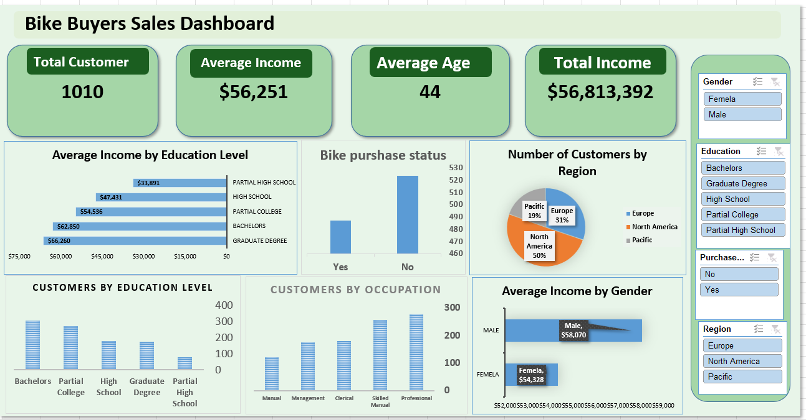

Bike Buyers Sales Dashboard

📊 Project Overview

This project is a data analysis dashboard created using Microsoft Excel to analyze bike buyers’ data and identify customer purchasing patterns.

🛠️ Tools Used

* Microsoft Excel
* Pivot Tables
* Pivot Charts
* Data Cleaning
* Data Analysis
* Dashboard Design

🎯 Project Objectives

* Analyze customer demographics.
* Understand bike purchasing behavior.
* Identify relationships between income, age, gender, and bike purchases.
* Create an interactive dashboard to present the analysis.
  
## Dashboard Preview

📁 Files

* Bike Buyers Sales Dashboard.xlsx — The complete Excel analysis and dashboard.

👤 Author

Abdelrhman Kamel 

## Dashboard Preview

ر
